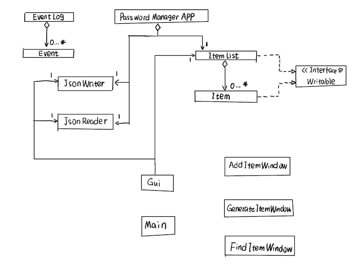

# Password Manager

## Description

The **primary function** of this application is to securely **store and manage user passwords**. Users will be able to *add*, *retrieve*, *change*, and *delete* passwords. The application will include a *search* feature to quickly locate stored passwords and an option to *generate* random, strong passwords. By offering a centralized and secure location for password management, the "Password Manager" will make it easier and more efficient for users to handle multiple passwords.

This application is **designed for** people who needs to *manage numerous passwords securely*. This project is of **great interest** to me because in my daily life, I find managing numerous passwords is time-consuming and difficult for me. Developing this application will allow me to deepen my understanding of Java programming, while creating a tool that provides real value by helping users manage thier passwords.

## User Stories
- As a user, I want to be able to add a set of username, password to my Manager and I can give them an item name
- As a user, I want to be able to view the list of item names in my Manager
- As a user, I want to be able to delete a password from my Manager
- As a user, I want to be able to generate random, strong passwords in my Manager
- As a user, I want to be able to find passwords in my Manager
- As a user, I want to be able to save my item list to file (if I so choose)
- As a user, I want to be able to be able to load my item list from file (if I so choose)


## Instructions for Grader
- You can generate the first required action related to the user story "adding multiple Xs to a Y" by clicking the button labelled **"Add Password"**.
- You can find passwords by clicking the button labelled **"Find Password"**.
  Because "find" is an ambiguous action, you can simply enter parts of the item name to receive a list of items.
- You can view passwords by clicking the button labelled **"View List"**.
- You can delete passwords by clicking the button labelled **"Delete Password"**. Because "delete" is a serious action, you need to enter full item name
  and username to do this.
- You can generate passwords by clicking the button labelled **"Generate Password"**.
- You can locate my **visual component** by *background*, and also when you click the button labelled *"Add Password"*.
- You can **save the state** of my application by click "Yes" buttons when you try to quit. You could have pop-up windows that give the user the option (using Yes/No buttons) to save data.  
- You can **reload the state** of my application by click "Yes" buttons when you start. You could have pop-up windows that give the user the option (using Yes/No buttons) to load data. 


## Phase 4: Task 2
```
Mon Aug 05 17:38:27 PDT 2024
item added to ItemList.
Mon Aug 05 17:38:27 PDT 2024
get items.
Mon Aug 05 17:38:29 PDT 2024
generate password.
Mon Aug 05 17:38:34 PDT 2024
item added to ItemList.
Mon Aug 05 17:38:34 PDT 2024
get items.
Mon Aug 05 17:38:38 PDT 2024
find item from ItemList.
Mon Aug 05 17:38:43 PDT 2024
item deleted from ItemList.
Mon Aug 05 17:38:44 PDT 2024
get items.
```

## Phase 4: Task 3
### UML Class Diagram




Reflecting on the current design, I am pleased with how the model turned out. And therelationship between Item and ItemList seems clear and effective.

I can enhance the UI package by improving class cohesion slightly. Having too many elements in a single class made it cumbersome and less readable, particularly when dealing with numerous similar lines of code. Instead of consolidating everything into one class, consider refactoring each GUI component into its own separate class. This approach would boost program cohesion without adding excessive coupling.


